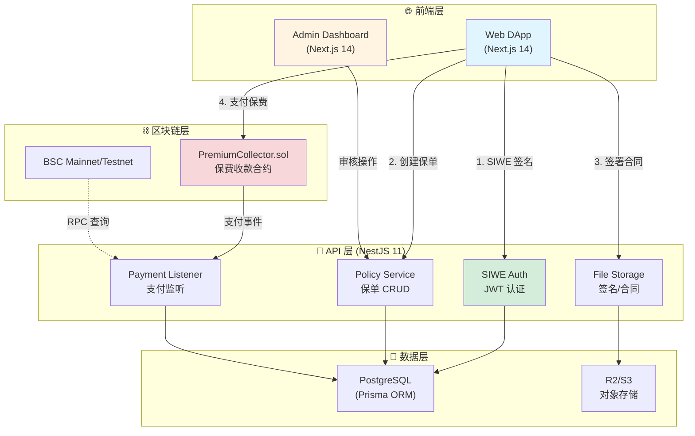

# 🛡️ Cohe Capital - Web3 Insurance DApp

一个面向 Web3 用户的 **去中心化登录 + 中心化管理** 的保险 DApp MVP。支持 **BSC 链钱包登录、电子合同签署、保费支付、后台审核与倒计时承保状态**。

**技术栈**: Next.js 14 + NestJS 11 + Prisma + PostgreSQL + ethers v6 + Reown AppKit

> 📚 **完整文档请访问**: [docs/README.md](docs/README.md)

---

## 🚀 Quick Start

### 选择你的角色

| 角色 | 快速入口 |
|------|---------|
| 🧑‍💻 **开发者** (首次) | [本地开发指南](docs/LOCAL_DEVELOPMENT.md) → 10 分钟快速启动 |
| 🚀 **DevOps** (部署) | [部署指南](docs/DEPLOYMENT.md) / [繁体中文版](docs/DEPLOYMENT.zh-TW.md) |
| 🏗️ **架构师** (深入) | [系统架构白皮书](docs/Cohe-Capital-架构系统白皮书.md) (71KB 完整技术文档) |
| 📋 **项目经理** (进度) | [路线图](docs/ROADMAP.md) + [变更日志](docs/CHANGELOG.md) |
| ⚙️ **运维** (日常) | [运维指南](docs/OPERATIONS.md) |

### 最小化启动（3 步）

```bash
# 1. 安装依赖
pnpm install

# 2. 启动本地环境 (Docker + 数据库 + API + Web)
./setup-local-dev.sh

# 3. 访问服务
# - Web DApp: http://localhost:3000
# - API: http://localhost:3001
# - API Docs: http://localhost:3001/api-docs
```

详细配置请参考 [本地开发指南](docs/LOCAL_DEVELOPMENT.md)

---

## 📖 项目简介

**Cohe Capital** 是一个面向 Web3 用户的保险 DApp，结合去中心化身份认证与中心化业务管理，提供流畅的保险购买与管理体验。

### 核心功能

- ✅ **钱包登录**: 基于 SIWE (EIP-4361) 的去中心化身份认证
- 📝 **电子合同**: 手写签名 + SHA256 哈希存证
- 💰 **链上支付**: 支持 BEP-20 USDT 保费支付
- 🔍 **后台审核**: 管理员审批保单，激活承保状态
- ⏱️ **倒计时承保**: 90 天保单期限实时倒计时
- 🔐 **安全存证**: 签名、合同、支付记录完整审计链

> 📊 **项目进度**: 71.6% 完成 | 查看 [路线图](docs/ROADMAP.md)

---

## 🏗️ 系统架构



> 📚 详细架构设计请查看 [系统架构白皮书](docs/Cohe-Capital-架构系统白皮书.md)

---

## 🧩 技术栈

### 前端层
- **Web DApp**: Next.js 14 (App Router) + TypeScript 5.3
- **钱包集成**: Reown AppKit + ethers v6
- **状态管理**: Zustand + TanStack Query
- **UI 框架**: Tailwind CSS + shadcn/ui
- **国际化**: next-intl (支持繁体中文/英文)

### 后端层
- **框架**: NestJS 11 + Fastify 5
- **ORM**: Prisma 6 + PostgreSQL 14+
- **认证**: SIWE (EIP-4361) + JWT (15m 短期)
- **文件存储**: Cloudflare R2 / AWS S3

### 区块链层
- **网络**: BSC Mainnet / Testnet
- **库**: ethers v6
- **RPC**: Ankr / QuickNode
- **合约**: PremiumCollector.sol (保费收款)

### 基础设施
- **Monorepo**: pnpm workspace + Turbo
- **容器化**: Docker + Docker Compose
- **部署**: Nginx + Cloudflare CDN
- **监控**: Winston Logger + 健康检查

> 🔍 完整技术栈详情请参考 [系统架构白皮书 - 第 3 章](docs/Cohe-Capital-架构系统白皮书.md#3-技术栈详解)

---

## 📦 项目结构

```
cohe-capitl-monorepo/
├── apps/
│   ├── web/              # 🌐 Web DApp (Next.js 14) - 主要用户端
│   ├── admin/            # 🔧 Admin Dashboard (Next.js 14) - 管理后台
│   └── api/              # 🔌 Backend API (NestJS 11) - 核心业务逻辑
│
├── packages/
│   ├── ui/               # 🎨 共享 UI 组件库
│   ├── types/            # 📝 共享 TypeScript 类型定义
│   └── config/           # ⚙️ 共享配置 (tsconfig/eslint/prettier)
│
├── contracts/
│   └── PremiumCollector.sol  # 💎 保费收款智能合约 (Solidity)
│
├── infra/
│   ├── docker/           # 🐳 Docker Compose 配置
│   └── scripts/          # 📜 自动化脚本 (启动/测试/部署)
│
├── docs/                 # 📚 完整项目文档
│   ├── README.md         # 文档导航中心
│   ├── LOCAL_DEVELOPMENT.md
│   ├── DEPLOYMENT.md
│   └── ...
│
└── setup-local-dev.sh    # 🚀 一键启动脚本
```

> 📂 各模块详细说明请查看对应目录下的 README.md

---

## 🗄️ 核心数据模型

```
User (用户)
├── walletAddress (钱包地址, 唯一)
├── email (可选)
└── policies[] (关联保单)

SKU (保险产品)
├── name (产品名称)
├── chainId + tokenAddress (支付代币)
├── termDays (承保天数, 默认 90)
└── minPremium / maxCoverage (保费/保额范围)

Policy (保单)
├── user (所属用户)
├── skuId (保险产品)
├── coverageAmt / premiumAmt (保额/保费)
├── contractHash + userSig (合同哈希 + 用户签名)
├── status (Draft → UnderReview → Active → Expired)
└── @@unique([walletAddress, skuId]) 单用户单产品唯一约束

Payment (支付记录)
├── policyId (关联保单)
├── txHash (交易哈希, 唯一)
├── chainId + tokenAddr (链 ID + 代币地址)
└── confirmed (确认状态)
```

> 🔍 完整数据模型与 ERD 图请查看 [系统架构白皮书 - 第 4 章](docs/Cohe-Capital-架构系统白皮书.md#4-数据模型与-erd)

---

## 🔄 业务流程

### 完整保单流程

```
1. 🔐 钱包登录
   ↓ SIWE 签名认证 (EIP-4361)
   ↓ 后端验证签名并签发 JWT (15m)

2. 📝 创建保单
   ↓ 选择保险产品 (SKU)
   ↓ 填写保额、受益人等信息
   ↓ 生成 Policy (Draft)

3. ✍️ 签署合同
   ↓ contractHash = SHA256(合同内容 + 表单数据)
   ↓ 用户 personal_sign 签名
   ↓ 保存签名 → Policy (UnderReview)

4. 💰 支付保费
   ↓ BEP-20 USDT 转账到金库地址
   ↓ 或调用 PremiumCollector.sol 合约
   ↓ 后端监听链上事件 → 记录 Payment

5. ✅ 后台审核
   ↓ Admin 审查保单信息
   ↓ Approve → Policy (Active, startAt/endAt)
   ↓ Reject → Policy (Rejected)

6. ⏱️ 承保倒计时
   ↓ 用户查看 endAt - now 剩余天数
   ↓ 到期后 → Policy (Expired)
```

> 🔍 详细业务流程与时序图请查看 [系统架构白皮书 - 第 5 章](docs/Cohe-Capital-架构系统白皮书.md#5-业务流程详解)

---

## 📡 核心 API

### 用户端 API

```
认证
├── POST /auth/siwe/nonce          # 获取签名随机数
└── POST /auth/siwe/verify         # 验证 SIWE 签名，返回 JWT

保险产品
├── GET /products                  # 获取产品列表
└── GET /products/:id              # 获取产品详情

保单管理
├── POST /policy                   # 创建保单 (Draft)
├── POST /policy/:id/sign          # 签署合同 (UnderReview)
├── POST /policy/:id/signature     # 上传手写签名
├── GET /policy/:id                # 获取保单详情
└── GET /policy/user/:address      # 获取用户所有保单

支付
└── POST /payment/verify           # 验证链上支付
```

### 管理端 API

```
后台认证
└── POST /admin/login              # 管理员登录

保单审核
├── GET /admin/policies            # 获取待审核保单列表
├── POST /admin/policies/:id/approve  # 批准保单
└── POST /admin/policies/:id/reject   # 拒绝保单
```

> 📖 完整 API 文档:
> - 本地: http://localhost:3001/api-docs
> - 生产: https://yourdomain.com/api-docs
> - 详细说明: [系统架构白皮书 - 第 6 章](docs/Cohe-Capital-架构系统白皮书.md#6-api-设计)

---

## 🔒 安全特性

- ✅ **SIWE 认证**: EIP-4361 标准，防重放攻击
- ✅ **JWT 短期令牌**: 15 分钟过期，写操作校验地址一致性
- ✅ **合同哈希存证**: SHA256 哈希，任何修改使签名失效
- ✅ **手写签名验证**: Canvas 生成 PNG + SHA256 校验
- ✅ **支付链上验证**: 验证交易哈希、金额、地址
- ✅ **审计日志**: 完整记录登录、签署、支付、审批操作
- ✅ **唯一约束**: `(walletAddress, skuId)` 防止重复购买
- ✅ **私有存储**: 签名/合同文件使用签名 URL 访问

> 🔐 安全设计详情请查看 [系统架构白皮书 - 第 11 章](docs/Cohe-Capital-架构系统白皮书.md#11-安全设计)

---

## 📚 完整文档导航

### 核心文档 (SSoT)

| 文档 | 用途 | 适合人群 |
|------|------|---------|
| [🏗️ 系统架构白皮书](docs/Cohe-Capital-架构系统白皮书.md) | 完整技术设计文档 | 架构师、技术负责人 |
| [🔧 本地开发指南](docs/LOCAL_DEVELOPMENT.md) | 快速启动开发环境 | 开发者 |
| [🚀 部署指南 (EN)](docs/DEPLOYMENT.md) | 生产环境部署 | DevOps 工程师 |
| [🚀 部署指南 (繁中)](docs/DEPLOYMENT.zh-TW.md) | 生产環境部署 (香港客戶) | DevOps 工程師 |
| [⚙️ 运维指南](docs/OPERATIONS.md) | 日常运维操作 | SRE、运维人员 |
| [🗺️ 路线图](docs/ROADMAP.md) | 项目进度与规划 | 项目经理、团队 |
| [📝 变更日志](docs/CHANGELOG.md) | 开发历史记录 | 全员 |

### 深入文档

| 文档 | 用途 | 字数 |
|------|------|------|
| [🏗️ 系统架构白皮书](docs/Cohe-Capital-架构系统白皮书.md) | 完整技术设计文档 | 71,000+ |

### 代码规范

| 文档 | 用途 |
|------|------|
| [CODEX.md](CODEX.md) | 编码规范与最佳实践 |
| [CLAUDE.md](CLAUDE.md) | AI 协作指南与进度追踪规则 |

### 归档文档

历史文档与过程性知识: [docs/archived/](docs/archived/)

---

## 🛠️ 开发工具链

### 推荐 IDE

- **VSCode** + 推荐扩展:
  - Prisma
  - ESLint
  - Prettier
  - Tailwind CSS IntelliSense
  - Solidity

### 常用命令

```bash
# 开发
pnpm --filter web dev           # 启动 Web 前端
pnpm --filter admin dev         # 启动 Admin 后台
pnpm --filter api dev           # 启动 API 后端

# 数据库
pnpm --filter api prisma:studio # 打开 Prisma Studio
pnpm --filter api prisma:migrate # 运行数据库迁移
pnpm --filter api prisma:seed   # 填充测试数据

# 构建
pnpm build                      # 构建所有应用
pnpm --filter web build         # 仅构建 Web

# 测试
pnpm test                       # 运行所有测试
pnpm --filter api test          # 仅测试 API

# 代码质量
pnpm lint                       # 代码检查
pnpm format                     # 格式化代码
```

---

## 🤝 贡献指南

### 开发流程

1. 创建功能分支: `git checkout -b feature/your-feature`
2. 开发并遵循 [CODEX.md](CODEX.md) 规范
3. 编写测试并确保通过
4. 提交代码: 遵循 [Conventional Commits](https://www.conventionalcommits.org/)
5. 推送并创建 Pull Request

### 文档更新要求 (CLAUDE.md 规则)

完成功能后必须更新:
- ✅ `docs/CHANGELOG.md` - 添加详细变更记录
- ✅ `docs/ROADMAP.md` - 更新任务状态

---

## 📊 项目状态

- **进度**: 71.6% 完成
- **当前 Sprint**: Epic 3 - 前端核心功能
- **下一步**: Admin 审核流程 + 倒计时逻辑

查看详细进度: [docs/ROADMAP.md](docs/ROADMAP.md)

---

## 📞 联系与支持

- **问题反馈**: 创建 GitHub Issue
- **技术讨论**: 查看 [docs/README.md](docs/README.md) FAQ 部分
- **部署问题**: 参考 [docs/DEPLOYMENT.md](docs/DEPLOYMENT.md) 故障排除章节

---

## 📄 许可证

© 2025 Cohe Capital. All rights reserved.

---

**Built with ❤️ using Next.js, NestJS, Prisma, and Web3 technologies**
