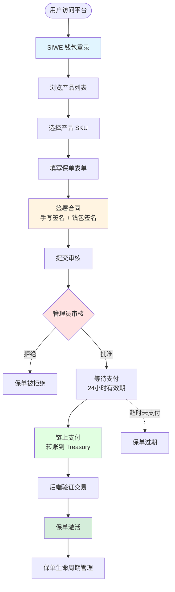
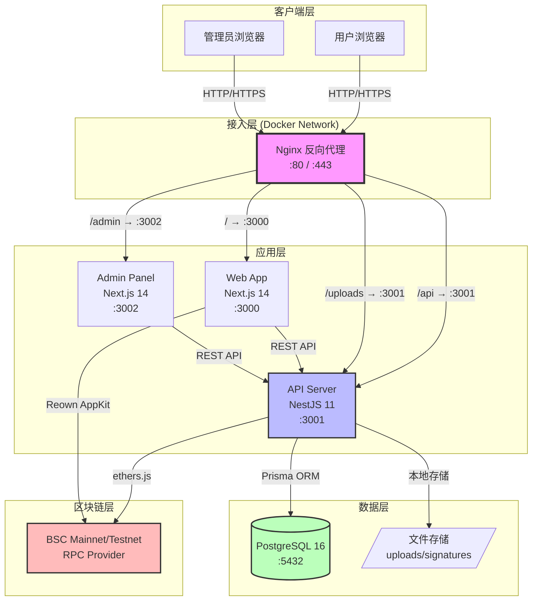
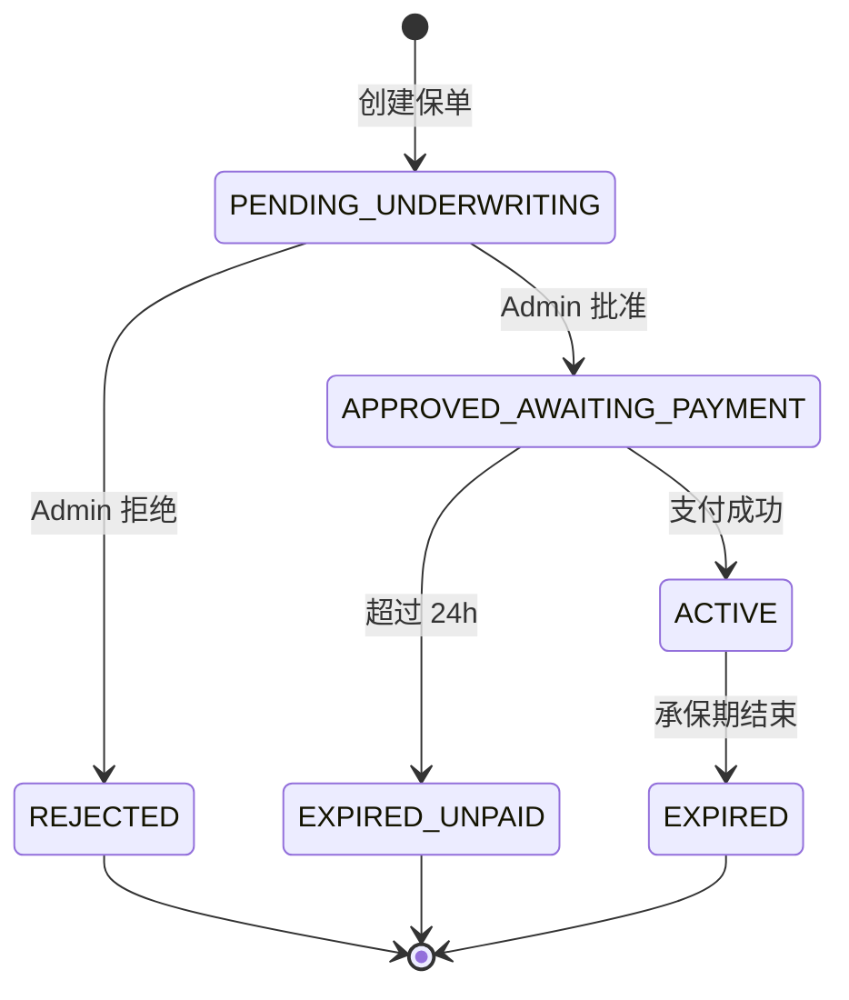
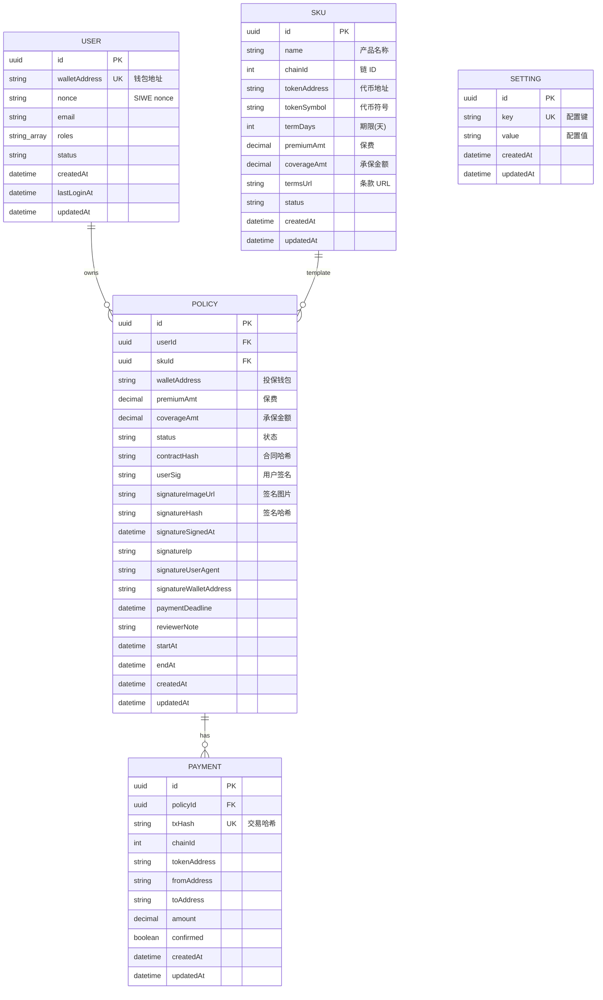
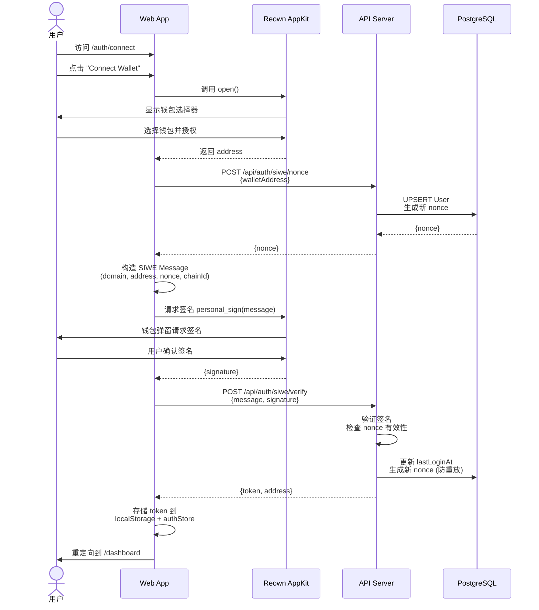
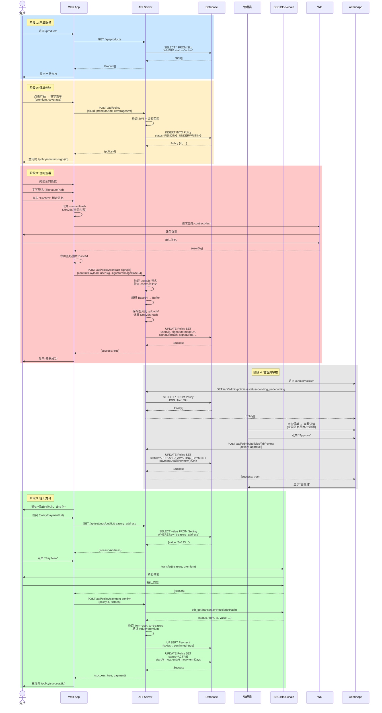

# 📘 Cohe Capital 架构系统白皮书

**版本**: v1.0.0
**最后更新**: 2025-11-20
**文档状态**: 正式版（基于实际代码库生成）
**适用阶段**: MVP 稳定化 → Demo 发布 → 生产部署
**作者**: Cohe Capital 技术架构组

---

## 📑 目录

1. [简介](#1-简介)
2. [系统目标](#2-系统目标)
3. [产品角色与业务流程](#3-产品角色与业务流程)
4. [整体技术架构](#4-整体技术架构)
5. [技术栈详解](#5-技术栈详解)
6. [核心功能模块](#6-核心功能模块)
7. [数据模型](#7-数据模型)
8. [业务流程详解](#8-业务流程详解)
9. [手写签名系统](#9-手写签名系统)
10. [区块链集成](#10-区块链集成)
11. [安全设计](#11-安全设计)
12. [部署架构](#12-部署架构)
13. [国际化与本地化](#13-国际化与本地化)
14. [监控与日志](#14-监控与日志)
15. [测试策略](#15-测试策略)
16. [路径规划](#16-路径规划)
17. [附录](#17-附录)

---

## 1. 简介

### 1.1 项目概述

Cohe Capital 是一个基于区块链的**去中心化保险平台**，为 Web3 用户提供透明、安全、高效的保险服务。平台采用现代化的技术栈，实现了从用户注册、产品选购、合同签署到链上支付的完整业务闭环。

### 1.2 核心特性

- ✅ **Web3 原生登录**: 基于 SIWE (EIP-4361) 的去中心化身份认证
- ✅ **链上支付**: BSC 区块链支付，支持 USDT/USDC/BNB 等代币
- ✅ **电子签名**: 手写签名 + 加密签名双重保障
- ✅ **多角色系统**: 用户端、管理员审核系统完整分离
- ✅ **容器化部署**: Docker + Nginx 生产级部署方案
- ✅ **国际化支持**: 英文 / 繁体中文双语

### 1.3 项目架构

本项目采用 **Monorepo** 架构，使用 pnpm workspace + Turbo 进行构建编排：

```
cohe-capitl-monorepo/
├── apps/
│   ├── web/          # Next.js 14 用户端 Web DApp
│   ├── admin/        # Next.js 14 管理后台
│   └── api/          # NestJS 后端 API
├── packages/         # 共享包 (预留)
├── infra/            # 基础设施配置 (Docker, Nginx)
└── docs/             # 项目文档
```

---

## 2. 系统目标

### 2.1 业务目标

构建一个**安全、透明、高效**的 Web3 保险平台，支持以下完整业务闭环：

```
产品浏览 → 保单创建 → 合同签署 → 风控审核 → 链上支付 → 保单激活 → 生命周期管理
```

### 2.2 技术目标

| 目标类别 | 具体要求 |
|---------|---------|
| **安全性** | SIWE 去中心化登录、JWT 认证、签名验证、审计日志 |
| **可扩展性** | 模块化架构、容器化部署、支持水平扩展 |
| **可维护性** | 类型安全 (TypeScript)、统一 Schema (Prisma)、清晰模块职责 |
| **高可用性** | 健康检查、自动重启、负载均衡 (Nginx) |
| **性能** | SSR + CSR 混合渲染、API 响应时间 < 200ms、数据库连接池 |

### 2.3 项目进度

**总体完成度**: 71.6% (截至 2025-11-20)

| Epic | 完成率 | 状态 |
|------|--------|------|
| E1: 后端基础与认证 | 100% (4/4) | ✅ 完成 |
| E2: 保单购买闭环 | 100% (11/11) | ✅ 完成 |
| E4: Web DApp | 83.3% (5/6) | 🟡 进行中 |
| E7: Admin 审核前端 | 100% (8/8) | ✅ 完成 |
| E6: 部署与演示环境 | 25% (1/4) | 🟡 进行中 |

---

## 3. 产品角色与业务流程

### 3.1 角色定义

| 角色 | 权限与职责 | 认证方式 |
|------|-----------|---------|
| **用户 (User)** | 连接钱包、浏览产品、购买保险、签署合同、查看保单 | SIWE + JWT |
| **管理员 (Admin)** | 审核保单 (批准/拒绝)、查看签名元数据、管理系统配置 | Bearer Token |
| **系统 (System)** | 生成 nonce、验证签名、记录交易、状态机管理 | 内部服务 |

### 3.2 业务流程图



---

## 4. 整体技术架构

### 4.1 系统架构图



### 4.2 技术选型理由

| 技术组件 | 选型理由 |
|---------|---------|
| **Next.js 14** | Server Components、App Router、SSR/SSG 混合渲染、优秀的 SEO |
| **NestJS 11** | 模块化架构、依赖注入、装饰器、成熟的企业级框架 |
| **Fastify** | 比 Express 快 2-3 倍、低开销、与 NestJS 深度集成 |
| **Prisma 6** | 类型安全、自动生成 Client、Schema-first、优秀的迁移工具 |
| **PostgreSQL 16** | ACID 保证、JSON 支持、强大的索引、成熟稳定 |
| **Docker Compose** | 本地开发一致性、快速部署、易于调试 |
| **Reown AppKit** | WalletConnect v2、支持多钱包、UI 组件完整 |

---

## 5. 技术栈详解

### 5.1 前端 Web DApp (apps/web/)

#### 核心依赖

```json
{
  "framework": {
    "next": "14.2.0",
    "react": "18.3.1",
    "react-dom": "18.3.1"
  },
  "web3": {
    "@reown/appkit": "1.8.14",
    "@reown/appkit-adapter-ethers": "1.8.14",
    "ethers": "6.13.0",
    "viem": "2.38.5"
  },
  "state": {
    "zustand": "5.0.8",
    "@tanstack/react-query": "5.62.11"
  },
  "form": {
    "react-hook-form": "7.54.0",
    "zod": "3.23.8",
    "@hookform/resolvers": "3.9.1"
  },
  "ui": {
    "tailwindcss": "3.4.17",
    "signature_pad": "5.1.2"
  },
  "utils": {
    "axios": "1.7.7",
    "dayjs": "1.11.13"
  }
}
```

#### 页面路由结构

| 路由 | 功能 | 认证要求 |
|------|------|---------|
| `/` | 首页 (重定向) | 否 |
| `/auth/connect` | SIWE 登录 | 否 |
| `/dashboard` | 仪表板 | ✅ JWT |
| `/products` | 产品列表 | ✅ JWT |
| `/policy/form/[productId]` | 保单表单 | ✅ JWT |
| `/policy/contract-sign/[policyId]` | 合同签署 | ✅ JWT |
| `/policy/payment/[policyId]` | 支付页面 | ✅ JWT |
| `/policy/success/[policyId]` | 购买成功 | ✅ JWT |
| `/my-policies` | 我的保单 | ✅ JWT |
| `/settings` | 设置 | ✅ JWT |

### 5.2 管理后台 (apps/admin/)

#### 核心依赖

```json
{
  "framework": {
    "next": "14.2.0",
    "react": "18.3.0"
  },
  "ui": {
    "@radix-ui/react-dialog": "1.0.5",
    "@radix-ui/react-dropdown-menu": "2.0.6",
    "@radix-ui/react-select": "2.0.0",
    "@radix-ui/react-tabs": "1.0.4",
    "@radix-ui/react-toast": "1.1.5",
    "lucide-react": "0.344.0"
  },
  "table": {
    "@tanstack/react-table": "8.13.0"
  },
  "state": {
    "zustand": "5.0.8",
    "@tanstack/react-query": "5.28.0"
  }
}
```

#### 主要功能

- 保单列表 (分页、筛选、搜索)
- 保单详情查看 (包含手写签名图片)
- 审核操作 (批准 / 拒绝 + 备注)
- 支付倒计时显示
- 响应式设计 (shadcn/ui)

### 5.3 后端 API (apps/api/)

#### 核心依赖

```json
{
  "framework": {
    "@nestjs/core": "11.1.7",
    "@nestjs/common": "11.1.7",
    "@nestjs/platform-fastify": "11.1.7",
    "fastify": "5.6.1"
  },
  "database": {
    "@prisma/client": "6.18.0",
    "prisma": "6.18.0"
  },
  "auth": {
    "@nestjs/jwt": "11.0.1",
    "@nestjs/passport": "11.0.5",
    "passport-jwt": "4.0.1",
    "siwe": "3.0.0",
    "bcryptjs": "3.0.2"
  },
  "web3": {
    "ethers": "6.x"
  },
  "validation": {
    "class-validator": "0.14.2",
    "class-transformer": "0.5.1",
    "zod": "4.1.12"
  },
  "logging": {
    "nestjs-pino": "4.3.0",
    "pino": "9.6.0",
    "pino-pretty": "13.1.0"
  },
  "testing": {
    "jest": "30.2.0",
    "@nestjs/testing": "11.1.7",
    "supertest": "7.1.4"
  }
}
```

#### 模块架构

```
apps/api/src/
├── modules/
│   ├── auth/              # SIWE 认证、JWT 策略
│   ├── products/          # 产品 (SKU) CRUD
│   ├── policy/            # 保单管理、签名存储
│   ├── payment/           # 支付验证、区块链服务
│   ├── admin/             # 后台管理
│   ├── settings/          # 系统配置
│   └── prisma/            # Prisma 服务
├── app.module.ts          # 根模块
└── main.ts                # 应用入口
```

---

## 6. 核心功能模块

### 6.1 认证模块 (Auth)

**路径**: `apps/api/src/modules/auth/`

#### 职责

- 生成 SIWE nonce
- 验证 SIWE 签名 (基于 EIP-4361)
- 签发 JWT token
- 用户信息管理
- Admin Bearer Token 验证

#### 关键组件

| 文件 | 功能 |
|------|------|
| `auth.service.ts` | SIWE 验证逻辑、用户 CRUD |
| `jwt.strategy.ts` | Passport JWT 策略 |
| `jwt.guard.ts` | JWT 路由守卫 |
| `admin.guard.ts` | Admin 认证守卫 |
| `siwe-nonce.dto.ts` | SIWE nonce 请求 DTO |
| `siwe-verify.dto.ts` | SIWE 签名验证 DTO |

#### API 端点

```http
POST   /api/auth/siwe/nonce           # 获取 nonce
POST   /api/auth/siwe/verify          # 验证签名并获取 token
GET    /api/auth/siwe/me              # 获取当前用户信息 (需 JWT)
```

#### SIWE 流程

```typescript
// 1. 前端请求 nonce
const { nonce } = await api.post('/api/auth/siwe/nonce', { walletAddress });

// 2. 构造 SIWE message
const message = new SiweMessage({
  domain: window.location.host,
  address: walletAddress,
  uri: window.location.origin,
  version: '1',
  chainId: 97,
  nonce,
});

// 3. 用户签名
const signature = await signer.signMessage(message.prepareMessage());

// 4. 后端验证
const { token } = await api.post('/api/auth/siwe/verify', { message, signature });
```

### 6.2 产品模块 (Products)

**路径**: `apps/api/src/modules/products/`

#### 职责

- 产品 (SKU) CRUD
- 活跃产品查询
- 产品详情获取

#### 数据结构

```typescript
interface Product {
  id: string;                    // UUID
  name: string;                  // 产品名称
  chainId: number;               // 链 ID (97 = BSC Testnet)
  tokenAddress: string;          // 支付代币地址
  tokenSymbol: string;           // 代币符号 (USDT, USDC, BNB)
  termDays: number;              // 保险期限 (天)
  premiumAmt: Decimal;           // 保费金额
  coverageAmt: Decimal;          // 承保金额
  termsUrl?: string;             // 条款 URL
  status: 'active' | 'inactive'; // 状态
}
```

#### API 端点

```http
GET    /api/products              # 获取活跃产品列表
GET    /api/products/:id          # 获取单个产品详情
```

### 6.3 保单模块 (Policy)

**路径**: `apps/api/src/modules/policy/`

#### 职责

- 保单创建
- 合同签署 (手写签名 + 加密签名)
- 保单状态管理
- 支付确认
- 保单查询

#### 保单状态机

```typescript
enum PolicyStatus {
  PENDING_UNDERWRITING = 'pending_underwriting',       // 待审核
  APPROVED_AWAITING_PAYMENT = 'approved_awaiting_payment', // 已批准，等待支付
  ACTIVE = 'active',                                   // 已激活
  REJECTED = 'rejected',                               // 已拒绝
  EXPIRED_UNPAID = 'expired_unpaid',                   // 超时未支付
  EXPIRED = 'expired',                                 // 已过期
}
```



#### API 端点

```http
POST   /api/policy                      # 创建保单
POST   /api/policy/contract-sign/:id    # 签署合同
GET    /api/policy/:id                  # 获取保单详情
POST   /api/policy/payment-confirm      # 确认支付
GET    /api/policy/countdown/:id        # 获取支付倒计时
GET    /api/policy/my-policies          # 获取当前用户保单列表
```

#### 签名存储服务

**路径**: `apps/api/src/modules/policy/signature-storage.service.ts`

```typescript
class SignatureStorageService {
  async saveSignatureImage(
    buffer: Buffer,
    mimeType: string,
    policyId: string,
  ): Promise<{ url: string; hash: string }> {
    // 1. 确保存储目录存在
    await this.ensureStorageDir();

    // 2. 生成文件名: {policyId}-{timestamp}.png
    const filename = `${policyId}-${Date.now()}.png`;
    const filepath = path.join(this.storageDir, filename);

    // 3. 计算 SHA256 哈希
    const hash = createHash('sha256').update(buffer).digest('hex');

    // 4. 写入文件
    await fs.writeFile(filepath, buffer);

    // 5. 返回 URL 和哈希
    return {
      url: `/uploads/signatures/${filename}`,
      hash,
    };
  }
}
```

### 6.4 支付模块 (Payment)

**路径**: `apps/api/src/modules/payment/`

#### 职责

- 链上交易验证
- 支付记录创建
- 保单激活

#### 区块链服务

**路径**: `apps/api/src/modules/payment/blockchain.service.ts`

```typescript
class BlockchainService {
  async verifyPayment(
    txHash: string,
    expectedFrom: string,
    expectedTo: string,
    expectedAmount: bigint,
    expectedTokenAddress?: string,
  ): Promise<boolean> {
    // 1. 获取交易 Receipt
    const receipt = await provider.getTransactionReceipt(txHash);

    // 2. 获取交易详情
    const tx = await provider.getTransaction(txHash);

    // 3. 验证交易状态
    if (receipt.status !== 1) return false;

    // 4. 验证地址和金额
    if (tx.from.toLowerCase() !== expectedFrom.toLowerCase()) return false;
    if (tx.to?.toLowerCase() !== expectedTo.toLowerCase()) return false;
    if (tx.value !== expectedAmount) return false;

    return true;
  }
}
```

#### API 端点

```http
POST   /api/policy/payment-confirm    # 确认支付并激活保单
```

### 6.5 管理员模块 (Admin)

**路径**: `apps/api/src/modules/admin/`

#### 职责

- 保单审核 (批准 / 拒绝)
- 保单列表查询 (分页、筛选)
- 统计数据查询

#### API 端点

```http
GET    /api/admin/policies                # 获取保单列表 (支持分页和筛选)
GET    /api/admin/policies/:id            # 获取保单详情
POST   /api/admin/policies/:id/review     # 审核保单
```

#### 审核请求

```typescript
interface ReviewPolicyDto {
  action: 'approve' | 'reject';
  reviewerNote?: string;
}
```

---

## 7. 数据模型

### 7.1 Entity Relationship Diagram (ERD)



### 7.2 Prisma Schema 摘要

**完整 Schema 路径**: `apps/api/prisma/schema.prisma`

#### 关键约束

- **所有金额**: `Decimal(38, 18)` - 避免浮点数精度问题
- **钱包地址**: 统一小写存储
- **唯一索引**: `walletAddress`, `txHash`, `setting.key`
- **级联删除**: `onDelete: Cascade` (Policy → Payment)

---

## 8. 业务流程详解

### 8.1 用户注册/登录流程 (SIWE)



**关键安全点**:

1. **Nonce 一次性**: 每次验证后生成新 nonce，防止重放攻击
2. **Message 完整性**: 包含 domain、chainId、timestamp，防止钓鱼
3. **Token 短期有效**: JWT 15 分钟过期，需刷新 token

### 8.2 保单购买完整流程



### 8.3 支付倒计时机制

```typescript
// apps/api/src/modules/policy/policy.service.ts
async approvePolicy(policyId: string) {
  const paymentDeadline = new Date();
  paymentDeadline.setHours(paymentDeadline.getHours() + 24);

  await this.prisma.policy.update({
    where: { id: policyId },
    data: {
      status: PolicyStatus.APPROVED_AWAITING_PAYMENT,
      paymentDeadline,
    },
  });
}

// 定时任务 (cron job) - 检查超时未支付
async expireUnpaidPolicies() {
  const now = new Date();
  await this.prisma.policy.updateMany({
    where: {
      status: PolicyStatus.APPROVED_AWAITING_PAYMENT,
      paymentDeadline: { lte: now },
    },
    data: {
      status: PolicyStatus.EXPIRED_UNPAID,
    },
  });
}
```

---

## 9. 手写签名系统

### 9.1 架构概览

手写签名系统是 Cohe Capital 的**核心合规功能**，确保电子合同的法律效力。

#### 系统组成

1. **前端签名组件** (`SignaturePad.tsx`)
2. **后端存储服务** (`signature-storage.service.ts`)
3. **数据库元数据** (Policy 表签名字段)
4. **静态文件服务** (Nginx `/uploads` 路由)

### 9.2 前端签名组件

**路径**: `apps/web/src/components/SignaturePad.tsx`

#### 功能特性

- ✅ Canvas 绘制 (支持鼠标 + 触摸屏)
- ✅ 三态系统: 未签名 → 已签名 → 已确认
- ✅ 确认后锁定 (防止篡改)
- ✅ 导出 PNG Base64
- ✅ 高 DPI 屏幕支持 (devicePixelRatio 缩放)

#### 组件 API

```typescript
interface SignaturePadHandle {
  isEmpty: () => boolean;          // 检查是否为空
  isConfirmed: () => boolean;      // 检查是否已确认
  clear: () => void;               // 清空签名
  getPNGDataURL: () => string;     // 获取 Base64
}

interface SignaturePadProps {
  onChange?: (signed: boolean) => void;      // 签名状态变化回调
  onConfirm?: (confirmed: boolean) => void;  // 确认状态变化回调
  height?: number;                           // Canvas 高度 (默认 200px)
  className?: string;                        // 自定义样式
}
```

#### 使用示例

```tsx
const signaturePadRef = useRef<SignaturePadHandle>(null);

<SignaturePad
  ref={signaturePadRef}
  onChange={(signed) => setIsSigned(signed)}
  onConfirm={(confirmed) => setIsConfirmed(confirmed)}
  height={250}
/>

// 提交时
if (!signaturePadRef.current.isConfirmed()) {
  alert('请确认您的签名');
  return;
}

const signatureBase64 = signaturePadRef.current.getPNGDataURL();
await api.post('/api/policy/contract-sign/:id', {
  signatureImageBase64: signatureBase64,
  ...
});
```

### 9.3 后端存储服务

**路径**: `apps/api/src/modules/policy/signature-storage.service.ts`

#### 存储策略

**当前 (Demo 环境)**:
- 本地文件存储: `uploads/signatures/`
- 文件命名: `{policyId}-{timestamp}.png`
- SHA256 哈希校验
- Nginx 静态文件服务

**生产环境建议**:
- Cloudflare R2 / AWS S3
- 签名 URL (有时效性)
- 私有 Bucket + IAM 权限
- 自动备份和版本控制

#### 实现代码

```typescript
@Injectable()
export class SignatureStorageService {
  private readonly storageDir = process.env.SIGNATURE_STORAGE_DIR || 'uploads/signatures';

  async saveSignatureImage(
    buffer: Buffer,
    mimeType: string,
    policyId: string,
  ): Promise<{ url: string; hash: string }> {
    // 1. 确保目录存在
    await this.ensureStorageDir();

    // 2. 生成文件名
    const timestamp = Date.now();
    const filename = `${policyId}-${timestamp}.png`;
    const filepath = path.join(this.storageDir, filename);

    // 3. 计算哈希
    const hash = createHash('sha256').update(buffer).digest('hex');

    // 4. 写入文件
    await fs.writeFile(filepath, buffer);

    // 5. 返回 URL
    return {
      url: `/uploads/signatures/${filename}`,
      hash,
    };
  }
}
```

### 9.4 安全特性

| 特性 | 实现方式 |
|------|---------|
| **完整性校验** | SHA256 哈希存储到数据库，管理员可验证 |
| **审计追踪** | 记录 IP、User-Agent、时间戳、钱包地址 |
| **防篡改** | 前端组件确认后锁定，后端哈希验证 |
| **访问控制** | 生产环境应使用私有存储 + 签名 URL |

### 9.5 未来增强

- [ ] **EIP-712 typed data 签名**: 将签名元数据上链
- [ ] **时间戳服务器**: RFC 3161 可信时间戳
- [ ] **电子印章**: 企业数字证书签名
- [ ] **法律存证**: 对接司法区块链存证平台

---

## 10. 区块链集成

### 10.1 支持的区块链网络

| 网络 | Chain ID | RPC URL | 代币标准 | 用途 |
|------|----------|---------|---------|------|
| **BSC Testnet** | 97 | https://data-seed-prebsc-1-s1.binance.org:8545/ | BEP-20 | 开发测试 |
| **BSC Mainnet** | 56 | https://bsc-dataseed.binance.org/ | BEP-20 | 生产环境 |

### 10.2 Web3 技术栈

#### 前端 (Web App)

```typescript
// apps/web/src/config/web3.ts
import { createAppKit } from '@reown/appkit/react';
import { Ethers5Adapter } from '@reown/appkit-adapter-ethers';

const chains = [
  {
    chainId: 97,
    name: 'BSC Testnet',
    currency: 'tBNB',
    explorerUrl: 'https://testnet.bscscan.com',
    rpcUrl: 'https://data-seed-prebsc-1-s1.binance.org:8545/',
  },
];

const appKit = createAppKit({
  adapters: [new Ethers5Adapter()],
  networks: chains,
  projectId: process.env.NEXT_PUBLIC_WALLETCONNECT_PROJECT_ID!,
});
```

#### 后端 (API)

```typescript
// apps/api/src/modules/payment/blockchain.service.ts
import { JsonRpcProvider } from 'ethers';

const provider = new JsonRpcProvider(
  'https://data-seed-prebsc-1-s1.binance.org:8545/'
);

// 验证交易
const receipt = await provider.getTransactionReceipt(txHash);
```

### 10.3 链上操作流程

#### 10.3.1 钱包连接

```typescript
// 用户点击 "Connect Wallet"
import { useAppKitAccount } from '@reown/appkit/react';

const { address, isConnected } = useAppKitAccount();

if (isConnected) {
  console.log('钱包地址:', address);
}
```

#### 10.3.2 SIWE 签名

```typescript
import { BrowserProvider } from 'ethers';
import { SiweMessage } from 'siwe';

// 1. 获取 nonce
const { nonce } = await api.post('/api/auth/siwe/nonce', { walletAddress });

// 2. 构造 SIWE message
const message = new SiweMessage({
  domain: window.location.host,
  address: walletAddress,
  uri: window.location.origin,
  version: '1',
  chainId: 97,
  nonce,
  issuedAt: new Date().toISOString(),
});

// 3. 请求签名
const provider = new BrowserProvider(window.ethereum);
const signer = await provider.getSigner();
const signature = await signer.signMessage(message.prepareMessage());

// 4. 验证并获取 token
const { token } = await api.post('/api/auth/siwe/verify', {
  message: message.prepareMessage(),
  signature,
});
```

#### 10.3.3 合同签名

```typescript
// 计算合同哈希
const contractHash = createHash('sha256')
  .update(JSON.stringify(contractPayload))
  .digest('hex');

// 用户签名哈希
const provider = new BrowserProvider(window.ethereum);
const signer = await provider.getSigner();
const userSig = await signer.signMessage(contractHash);

// 提交到后端
await api.post('/api/policy/contract-sign/:id', {
  contractPayload,
  userSig,
  signatureImageBase64,
});
```

#### 10.3.4 链上支付

```typescript
// 方式 1: 原生代币转账 (BNB)
const tx = await signer.sendTransaction({
  to: treasuryAddress,
  value: ethers.parseEther(premiumAmt.toString()),
});

// 方式 2: ERC-20/BEP-20 代币转账 (USDT)
const contract = new Contract(tokenAddress, ERC20_ABI, signer);
const tx = await contract.transfer(
  treasuryAddress,
  ethers.parseUnits(premiumAmt.toString(), 18)
);

// 等待确认
const receipt = await tx.wait();

// 提交后端验证
await api.post('/api/policy/payment-confirm', {
  policyId,
  txHash: receipt.hash,
});
```

### 10.4 智能合约 (规划中)

#### PremiumCollector.sol

```solidity
// SPDX-License-Identifier: MIT
pragma solidity ^0.8.20;

import "@openzeppelin/contracts/token/ERC20/IERC20.sol";
import "@openzeppelin/contracts/access/Ownable.sol";

contract PremiumCollector is Ownable {
    event PremiumReceived(
        address indexed payer,
        uint256 indexed policyId,
        address token,
        uint256 amount,
        uint256 timestamp
    );

    function purchasePolicy(
        uint256 policyId,
        address token,
        uint256 amount
    ) external {
        require(amount > 0, "Amount must be positive");

        IERC20(token).transferFrom(msg.sender, address(this), amount);

        emit PremiumReceived(
            msg.sender,
            policyId,
            token,
            amount,
            block.timestamp
        );
    }

    function withdraw(address token, uint256 amount) external onlyOwner {
        IERC20(token).transfer(owner(), amount);
    }
}
```

#### 事件监听 (后端)

```typescript
// 监听 PremiumReceived 事件自动确认支付
contract.on('PremiumReceived', async (payer, policyId, token, amount, timestamp) => {
  await this.paymentService.confirmPayment({
    policyId: policyId.toString(),
    txHash: event.transactionHash,
    amount: ethers.formatUnits(amount, 18),
  });
});
```

---

## 11. 安全设计

### 11.1 认证与授权

#### 11.1.1 用户认证 (SIWE + JWT)

**流程**:
1. SIWE nonce 生成 (随机 UUID)
2. 用户签名 SIWE message
3. 后端验证签名 + nonce 有效性
4. 签发 JWT token (15 分钟过期)
5. 每次验证后生成新 nonce (防重放)

**安全特性**:
- ✅ Nonce 一次性使用
- ✅ JWT 短期过期 + Refresh Token
- ✅ 钱包地址一致性校验
- ✅ 时间戳防重放 (5 分钟窗口)

#### 11.1.2 Admin 认证 (Bearer Token)

```typescript
// apps/api/src/modules/auth/admin.guard.ts
@Injectable()
export class AdminGuard implements CanActivate {
  canActivate(context: ExecutionContext): boolean {
    const request = context.switchToHttp().getRequest();
    const token = request.headers.authorization?.replace('Bearer ', '');

    const adminToken = process.env.ADMIN_TOKEN;
    if (!adminToken) throw new Error('ADMIN_TOKEN not configured');

    return token === adminToken;
  }
}
```

**使用**:
```typescript
@Controller('admin')
@UseGuards(AdminGuard)
export class AdminController {
  // 所有路由需要 Bearer Token
}
```

**生产环境改进**:
- [ ] 实现基于角色的访问控制 (RBAC)
- [ ] Admin 用户表 + JWT 认证
- [ ] 操作日志审计

### 11.2 数据验证

#### 11.2.1 API 层验证 (Zod)

```typescript
// apps/api/src/modules/policy/dto/create-policy.dto.ts
import { z } from 'zod';

export const createPolicySchema = z.object({
  skuId: z.string().uuid(),
  premiumAmt: z.string().regex(/^\d+(\.\d+)?$/),
  coverageAmt: z.string().regex(/^\d+(\.\d+)?$/),
});

export type CreatePolicyDto = z.infer<typeof createPolicySchema>;

// Controller
@Post()
async createPolicy(@Body() dto: CreatePolicyDto) {
  createPolicySchema.parse(dto); // 自动抛出验证错误
  // ...
}
```

#### 11.2.2 前端层验证 (react-hook-form + zod)

```typescript
// apps/web/src/app/policy/form/[productId]/page.tsx
import { useForm } from 'react-hook-form';
import { zodResolver } from '@hookform/resolvers/zod';
import { z } from 'zod';

const policyFormSchema = z.object({
  premiumAmt: z.string().min(1, '保费不能为空'),
  coverageAmt: z.string().min(1, '承保金额不能为空'),
});

const form = useForm({
  resolver: zodResolver(policyFormSchema),
});
```

### 11.3 文件上传安全

#### 11.3.1 当前实现 (本地存储)

```typescript
// 签名图片验证
async saveSignatureImage(buffer: Buffer, mimeType: string) {
  // 1. 检查 MIME 类型
  if (mimeType !== 'image/png') {
    throw new Error('Only PNG images are allowed');
  }

  // 2. 检查文件大小 (< 2MB)
  if (buffer.length > 2 * 1024 * 1024) {
    throw new Error('Image size exceeds 2MB');
  }

  // 3. 计算哈希
  const hash = createHash('sha256').update(buffer).digest('hex');

  // 4. 安全存储
  await fs.writeFile(filepath, buffer);

  return { url, hash };
}
```

#### 11.3.2 生产环境建议 (S3/R2)

```typescript
import { S3Client, PutObjectCommand } from '@aws-sdk/client-s3';
import { getSignedUrl } from '@aws-sdk/s3-request-presigner';

async saveToS3(buffer: Buffer, filename: string) {
  const s3 = new S3Client({ region: 'us-east-1' });

  // 上传到私有 Bucket
  await s3.send(new PutObjectCommand({
    Bucket: 'cohe-signatures',
    Key: `signatures/${filename}`,
    Body: buffer,
    ContentType: 'image/png',
    ServerSideEncryption: 'AES256',
    ACL: 'private', // 私有访问
  }));

  // 生成 1 小时有效的签名 URL
  const url = await getSignedUrl(s3, new GetObjectCommand({
    Bucket: 'cohe-signatures',
    Key: `signatures/${filename}`,
  }), { expiresIn: 3600 });

  return url;
}
```

### 11.4 审计日志

#### 11.4.1 Policy 表审计字段

```prisma
model Policy {
  // 签名审计
  signatureIp           String?    @db.VarChar(45)
  signatureUserAgent    String?
  signatureSignedAt     DateTime?
  signatureWalletAddress String?   @db.VarChar(42)

  // 审核审计
  reviewerNote          String?
  updatedAt             DateTime   @updatedAt
}
```

#### 11.4.2 建议增强 (独立审计表)

```prisma
model AuditLog {
  id            String   @id @default(uuid())
  userId        String?
  action        String   // 'policy.create', 'policy.sign', 'admin.review'
  resource      String   // 'Policy:uuid'
  ipAddress     String
  userAgent     String
  metadata      Json?    // 额外数据
  createdAt     DateTime @default(now())

  @@index([userId, action])
  @@index([createdAt])
}
```

### 11.5 安全最佳实践清单

- [x] **输入验证**: Zod schema 全链路验证
- [x] **认证**: SIWE + JWT
- [x] **HTTPS**: 生产环境强制 HTTPS
- [x] **CORS**: 配置正确的 origin
- [x] **Rate Limiting**: Nginx 限流 (10-30 req/s)
- [x] **安全头**: X-Frame-Options, CSP, X-Content-Type-Options
- [x] **SQL 注入防护**: Prisma 参数化查询
- [x] **XSS 防护**: React 自动转义 + DOMPurify (如需)
- [ ] **CSRF 保护**: SameSite cookies
- [ ] **秘钥轮换**: 定期更新 JWT_SECRET
- [ ] **依赖扫描**: npm audit / Snyk
- [ ] **安全审计**: 定期渗透测试

---

## 12. 部署架构

### 12.1 Docker Compose 架构

**配置文件**: `docker-compose.yml`

```yaml
services:
  # Nginx 反向代理
  nginx:
    image: nginx:alpine
    ports:
      - "80:80"
      - "443:443"
    volumes:
      - ./infra/nginx/nginx.conf:/etc/nginx/nginx.conf:ro
      - ./infra/nginx/conf.d:/etc/nginx/conf.d:ro
    depends_on:
      - web
      - admin
      - api
    networks:
      - cohe-network

  # Web 前端
  web:
    build:
      context: .
      dockerfile: apps/web/Dockerfile
    environment:
      - NEXT_PUBLIC_API_BASE=/api
      - NEXT_PUBLIC_CHAIN_ID=97
    networks:
      - cohe-network

  # Admin 后台
  admin:
    build:
      context: .
      dockerfile: apps/admin/Dockerfile
    environment:
      - NEXT_PUBLIC_ADMIN_API_BASE=/api
    networks:
      - cohe-network

  # API 后端
  api:
    build:
      context: .
      dockerfile: apps/api/Dockerfile
    environment:
      - DATABASE_URL=postgresql://user:pass@db:5432/cohe_capital
      - JWT_SECRET=${JWT_SECRET}
    volumes:
      - ./docker-volumes/uploads:/app/apps/api/uploads
    depends_on:
      - db
    networks:
      - cohe-network

  # PostgreSQL 数据库
  db:
    image: postgres:16-alpine
    environment:
      - POSTGRES_USER=cohe_user
      - POSTGRES_PASSWORD=${POSTGRES_PASSWORD}
      - POSTGRES_DB=cohe_capital_db
    volumes:
      - postgres-data:/var/lib/postgresql/data
    networks:
      - cohe-network

networks:
  cohe-network:
    driver: bridge

volumes:
  postgres-data:
```

### 12.2 Nginx 路由配置

**配置文件**: `infra/nginx/conf.d/default.conf`

```nginx
# Rate Limiting Zones
limit_req_zone $binary_remote_addr zone=api_limit:10m rate=10r/s;
limit_req_zone $binary_remote_addr zone=general_limit:10m rate=30r/s;

# Upstream 服务
upstream web_upstream {
    server web:3000;
}

upstream admin_upstream {
    server admin:3002;
}

upstream api_upstream {
    server api:3001;
}

server {
    listen 80;
    server_name _;
    server_tokens off;

    # 安全头
    add_header X-Frame-Options "SAMEORIGIN" always;
    add_header X-Content-Type-Options "nosniff" always;
    add_header X-XSS-Protection "1; mode=block" always;

    # Gzip 压缩
    gzip on;
    gzip_types text/plain text/css application/json application/javascript;

    # Web 前端
    location / {
        limit_req zone=general_limit burst=20 nodelay;
        proxy_pass http://web_upstream;
        proxy_set_header Host $host;
        proxy_set_header X-Real-IP $remote_addr;
    }

    # Admin 后台
    location /admin {
        limit_req zone=general_limit burst=20 nodelay;
        proxy_pass http://admin_upstream;
        proxy_set_header Host $host;
        proxy_set_header X-Real-IP $remote_addr;
    }

    # API 端点
    location /api {
        limit_req zone=api_limit burst=10 nodelay;
        proxy_pass http://api_upstream;
        proxy_set_header Host $host;
        proxy_set_header X-Real-IP $remote_addr;
    }

    # 静态文件 (签名图片)
    location /uploads {
        proxy_pass http://api_upstream;
    }

    # Swagger 文档
    location /api-docs {
        proxy_pass http://api_upstream;
    }

    # 健康检查
    location /health {
        access_log off;
        return 200 "healthy\n";
    }
}
```

### 12.3 Dockerfile 多阶段构建

**示例**: `apps/api/Dockerfile`

```dockerfile
# Stage 1: 依赖安装
FROM node:20-alpine AS deps
WORKDIR /app

RUN npm install -g pnpm@10.19.0

COPY pnpm-lock.yaml pnpm-workspace.yaml ./
COPY apps/api/package.json ./apps/api/
COPY apps/api/prisma ./apps/api/prisma

RUN pnpm install --frozen-lockfile

# 生成 Prisma Client
RUN cd apps/api && pnpm exec prisma generate

# Stage 2: 构建
FROM node:20-alpine AS builder
WORKDIR /app

COPY --from=deps /app/node_modules ./node_modules
COPY apps/api ./apps/api

RUN cd apps/api && npm run build

# Stage 3: 运行时
FROM node:20-alpine AS runner
WORKDIR /app

RUN apk add --no-cache dumb-init

# 非 root 用户
RUN addgroup --system --gid 1001 nodejs
RUN adduser --system --uid 1001 nestjs

COPY --from=builder --chown=nestjs:nodejs /app/apps/api/dist ./dist
COPY --from=builder --chown=nestjs:nodejs /app/apps/api/node_modules ./node_modules
COPY --from=builder --chown=nestjs:nodejs /app/apps/api/prisma ./prisma

USER nestjs

EXPOSE 3001

HEALTHCHECK --interval=30s --timeout=3s --start-period=5s --retries=3 \
  CMD node -e "require('http').get('http://localhost:3001/healthz', (r) => {process.exit(r.statusCode === 200 ? 0 : 1)})"

CMD ["dumb-init", "node", "dist/main.js"]
```

### 12.4 环境变量管理

**文件**: `.env.production`

```bash
# === 数据库 ===
DATABASE_URL=postgresql://cohe_user:${POSTGRES_PASSWORD}@db:5432/cohe_capital_db
POSTGRES_USER=cohe_user
POSTGRES_PASSWORD=<generated-password>
POSTGRES_DB=cohe_capital_db

# === JWT ===
JWT_SECRET=<openssl rand -base64 32>
JWT_EXPIRATION=15m
JWT_REFRESH_SECRET=<openssl rand -base64 32>
JWT_REFRESH_EXPIRATION=7d

# === SIWE ===
SIWE_DOMAIN=yourdomain.com
SIWE_URI=https://yourdomain.com

# === Admin ===
ADMIN_TOKEN=<openssl rand -hex 32>

# === 区块链 ===
NEXT_PUBLIC_CHAIN_ID=56  # BSC Mainnet
NEXT_PUBLIC_CHAIN_NAME=BSC Mainnet
NEXT_PUBLIC_WALLETCONNECT_PROJECT_ID=<your-project-id>

# === API 端点 ===
NEXT_PUBLIC_API_BASE=/api
NEXT_PUBLIC_ADMIN_API_BASE=/api

# === 文件存储 ===
SIGNATURE_STORAGE_DIR=uploads/signatures

# === CORS ===
CORS_ORIGIN=https://yourdomain.com

# === 其他 ===
NODE_ENV=production
PORT=3001
HOST=0.0.0.0
```

### 12.5 部署流程

**脚本**: `deploy.sh`

```bash
#!/bin/bash
set -e

echo "🚀 Starting Cohe Capital deployment..."

# 1. 拉取最新代码
git pull origin main

# 2. 安装依赖
pnpm install --frozen-lockfile

# 3. 数据库迁移
cd apps/api
pnpm exec prisma migrate deploy
cd ../..

# 4. 构建 Docker 镜像
docker-compose build --no-cache

# 5. 停止旧容器
docker-compose down

# 6. 启动新容器
docker-compose up -d

# 7. 健康检查
sleep 10
curl -f http://localhost/health || exit 1

echo "✅ Deployment completed successfully!"
```

### 12.6 生产环境清单

- [ ] **HTTPS 证书**: Let's Encrypt / Cloudflare SSL
- [ ] **域名配置**: DNS A 记录指向服务器
- [ ] **环境变量**: 所有秘钥已替换为生产值
- [ ] **数据库备份**: 每日自动备份 + 异地存储
- [ ] **监控告警**: Sentry, Prometheus, Uptime Robot
- [ ] **日志收集**: ELK Stack / Loki + Grafana
- [ ] **CI/CD**: GitHub Actions 自动部署
- [ ] **负载测试**: k6 / Artillery 压力测试
- [ ] **安全扫描**: OWASP ZAP, Snyk
- [ ] **灾难恢复**: 备份恢复演练

---

## 13. 国际化与本地化

### 13.1 支持语言

| 语言 | 代码 | 覆盖率 | 文件路径 |
|------|------|--------|---------|
| **英文** | `en` | 100% | `apps/web/src/locales/en.ts` |
| **繁体中文** | `zh-TW` | 100% | `apps/web/src/locales/zh-TW.ts` |

### 13.2 实现架构

#### 13.2.1 语言切换器组件

**路径**: `apps/web/src/components/LanguageSwitcher.tsx`

```typescript
import { useLocaleStore } from '@/store/localeStore';

export function LanguageSwitcher() {
  const { locale, setLocale } = useLocaleStore();

  return (
    <select value={locale} onChange={(e) => setLocale(e.target.value)}>
      <option value="en">English</option>
      <option value="zh-TW">繁體中文</option>
    </select>
  );
}
```

#### 13.2.2 Zustand Store

**路径**: `apps/web/src/store/localeStore.ts`

```typescript
import { create } from 'zustand';
import { persist } from 'zustand/middleware';
import { en } from '@/locales/en';
import { zhTW } from '@/locales/zh-TW';

interface LocaleStore {
  locale: 'en' | 'zh-TW';
  translations: typeof en;
  setLocale: (locale: 'en' | 'zh-TW') => void;
}

export const useLocaleStore = create<LocaleStore>()(
  persist(
    (set) => ({
      locale: 'en',
      translations: en,
      setLocale: (locale) =>
        set({
          locale,
          translations: locale === 'en' ? en : zhTW,
        }),
    }),
    { name: 'locale-storage' }
  )
);
```

#### 13.2.3 翻译文件结构

**示例**: `apps/web/src/locales/en.ts`

```typescript
export const en = {
  common: {
    appName: 'COHE.CAPITL',
    loading: 'Loading...',
    submit: 'Submit',
    // ...
  },
  auth: {
    connectWallet: 'Connect Wallet',
    signatureRequired: 'Signature Required',
    // ...
  },
  dashboard: {
    welcome: 'Welcome',
    totalCoverage: 'Total Coverage',
    // ...
  },
  // ... 更多命名空间
};
```

#### 13.2.4 使用方式

```tsx
// 页面组件
const { translations: t } = useLocaleStore();

<h1>{t.dashboard.welcome}</h1>
<button>{t.common.submit}</button>
<p>{t.auth.connectWallet}</p>
```

### 13.3 未来扩展

- [ ] **日语** (ja-JP)
- [ ] **韩语** (ko-KR)
- [ ] **西班牙语** (es-ES)
- [ ] **数字格式化**: Intl.NumberFormat
- [ ] **日期格式化**: dayjs locale
- [ ] **货币符号**: 根据语言切换 $ / ¥ / €
- [ ] **RTL 支持**: 阿拉伯语 / 希伯来语

---

## 14. 监控与日志

### 14.1 日志系统

#### 14.1.1 后端日志 (Pino)

**配置**: `apps/api/src/main.ts`

```typescript
import { Logger } from 'nestjs-pino';

const app = await NestFactory.create<NestFastifyApplication>(
  AppModule,
  adapter,
  { bufferLogs: true }
);

app.useLogger(app.get(Logger));
```

**日志级别**:
- `debug`: 详细调试信息
- `info`: 正常业务日志
- `warn`: 警告信息
- `error`: 错误信息

**日志格式** (JSON):
```json
{
  "level": 30,
  "time": 1705800000000,
  "pid": 1,
  "hostname": "api-container",
  "msg": "Signature saved: 123-1705800000000.png, hash: abc123...",
  "context": "SignatureStorageService"
}
```

#### 14.1.2 前端日志 (Console)

```typescript
// 生产环境建议集成 Sentry
if (process.env.NODE_ENV === 'production') {
  Sentry.init({
    dsn: process.env.NEXT_PUBLIC_SENTRY_DSN,
    environment: 'production',
  });
}
```

### 14.2 健康检查

#### 14.2.1 API 健康检查

**路径**: `apps/api/src/app.controller.ts`

```typescript
@Controller()
export class AppController {
  @Get('healthz')
  healthCheck() {
    return {
      status: 'ok',
      timestamp: new Date().toISOString(),
      uptime: process.uptime(),
    };
  }
}
```

#### 14.2.2 Docker Healthcheck

```dockerfile
HEALTHCHECK --interval=30s --timeout=3s --start-period=5s --retries=3 \
  CMD node -e "require('http').get('http://localhost:3001/healthz', (r) => {process.exit(r.statusCode === 200 ? 0 : 1)})"
```

#### 14.2.3 Nginx 健康检查

```nginx
location /health {
    access_log off;
    return 200 "healthy\n";
    add_header Content-Type text/plain;
}
```

### 14.3 性能监控 (建议)

#### 14.3.1 Prometheus + Grafana

```typescript
// apps/api/src/app.module.ts
import { PrometheusModule } from '@willsoto/nestjs-prometheus';

@Module({
  imports: [
    PrometheusModule.register({
      path: '/metrics',
      defaultMetrics: {
        enabled: true,
      },
    }),
  ],
})
export class AppModule {}
```

**指标示例**:
- `http_request_duration_seconds`: HTTP 请求耗时
- `http_requests_total`: HTTP 请求总数
- `db_query_duration_seconds`: 数据库查询耗时
- `policy_created_total`: 保单创建总数

#### 14.3.2 Sentry 错误追踪

```typescript
// apps/web/src/app/layout.tsx
import * as Sentry from '@sentry/nextjs';

Sentry.init({
  dsn: process.env.NEXT_PUBLIC_SENTRY_DSN,
  tracesSampleRate: 1.0,
  environment: process.env.NODE_ENV,
});
```

### 14.4 日志管理建议

| 工具 | 用途 | 优势 |
|------|------|------|
| **Loki + Grafana** | 日志聚合与查询 | 轻量级、与 Prometheus 集成 |
| **ELK Stack** | 日志分析与可视化 | 功能强大、生态丰富 |
| **CloudWatch Logs** | AWS 环境日志 | 原生集成、无需配置 |
| **Datadog** | APM + 日志 + 监控 | 全栈可观测性 |

---

## 15. 测试策略

### 15.1 已实现测试

#### 15.1.1 API 单元测试 (Jest)

**示例**: `apps/api/src/modules/auth/auth.service.spec.ts`

```typescript
describe('AuthService', () => {
  let service: AuthService;
  let prismaService: PrismaService;

  beforeEach(async () => {
    const module: TestingModule = await Test.createTestingModule({
      providers: [
        AuthService,
        {
          provide: PrismaService,
          useValue: mockPrismaService,
        },
      ],
    }).compile();

    service = module.get<AuthService>(AuthService);
  });

  it('should generate nonce for new user', async () => {
    const walletAddress = '0x123...';
    const result = await service.generateNonce(walletAddress);

    expect(result.nonce).toBeDefined();
    expect(result.nonce.length).toBeGreaterThan(0);
  });

  it('should verify valid SIWE signature', async () => {
    const message = '...';
    const signature = '0xabc...';

    const result = await service.verifySiweSignature(message, signature);

    expect(result.token).toBeDefined();
    expect(result.address).toBe('0x123...');
  });
});
```

#### 15.1.2 E2E 测试配置

**文件**: `apps/api/test/jest-e2e.json`

```json
{
  "moduleFileExtensions": ["js", "json", "ts"],
  "rootDir": ".",
  "testEnvironment": "node",
  "testRegex": ".e2e-spec.ts$",
  "transform": {
    "^.+\\.(t|j)s$": "ts-jest"
  }
}
```

### 15.2 测试覆盖率目标

| 层级 | 当前覆盖率 | 目标覆盖率 |
|------|-----------|-----------|
| **API 单元测试** | ~30% | 80% |
| **API E2E 测试** | 0% | 60% |
| **Web 组件测试** | 0% | 70% |
| **Admin 组件测试** | 0% | 60% |
| **E2E 浏览器测试** | 0% | 主流程覆盖 |

### 15.3 测试计划

#### 15.3.1 API 单元测试 (待完善)

- [ ] `products.service.spec.ts` - 产品 CRUD
- [ ] `policy.service.spec.ts` - 保单创建、签署、状态管理
- [ ] `payment.service.spec.ts` - 支付验证逻辑
- [ ] `blockchain.service.spec.ts` - 链上交易验证
- [ ] `signature-storage.service.spec.ts` - 签名图片存储

#### 15.3.2 Web 组件测试 (待实现)

```typescript
// apps/web/src/components/SignaturePad.test.tsx
import { render, screen } from '@testing-library/react';
import userEvent from '@testing-library/user-event';
import SignaturePad from './SignaturePad';

describe('SignaturePad', () => {
  it('should render canvas element', () => {
    render(<SignaturePad />);
    const canvas = screen.getByRole('img', { name: /signature/i });
    expect(canvas).toBeInTheDocument();
  });

  it('should show confirm button after signing', async () => {
    const onChange = jest.fn();
    render(<SignaturePad onChange={onChange} />);

    // 模拟签名
    const canvas = screen.getByRole('img');
    await userEvent.click(canvas);

    expect(onChange).toHaveBeenCalledWith(true);
    expect(screen.getByText('Confirm')).toBeInTheDocument();
  });
});
```

#### 15.3.3 E2E 测试 (Playwright)

```typescript
// e2e/policy-purchase.spec.ts
import { test, expect } from '@playwright/test';

test('complete policy purchase flow', async ({ page }) => {
  // 1. 连接钱包
  await page.goto('http://localhost:3000/auth/connect');
  await page.click('button:has-text("Connect Wallet")');
  // ... MetaMask 交互

  // 2. 选择产品
  await page.goto('http://localhost:3000/products');
  await page.click('text=Crypto Wallet Protection');

  // 3. 填写表单
  await page.fill('input[name="premiumAmt"]', '100');
  await page.fill('input[name="coverageAmt"]', '10000');
  await page.click('button:has-text("Create Policy")');

  // 4. 签署合同
  await expect(page).toHaveURL(/\/policy\/contract-sign\/.+/);
  // ... 签名操作
  await page.click('button:has-text("Confirm")');
  await page.click('button:has-text("Sign Contract")');

  // 5. 支付
  await expect(page).toHaveURL(/\/policy\/payment\/.+/);
  await page.click('button:has-text("Pay Now")');
  // ... MetaMask 交易确认

  // 6. 成功页面
  await expect(page).toHaveURL(/\/policy\/success\/.+/);
  await expect(page.locator('text=Policy Activated')).toBeVisible();
});
```

---

## 16. 路径规划

### 16.1 短期目标 (1-2 周)

#### Sprint: 完善 MVP 核心功能

- [ ] **保单详情页** (Issue #36)
  - 显示保单完整信息
  - 支付倒计时显示
  - 保单状态卡片

- [ ] **支付确认优化**
  - 交易状态轮询
  - 失败重试机制
  - 用户友好的错误提示

- [ ] **Admin Panel 增强**
  - 数据统计 Dashboard
  - 批量操作 (批量批准)
  - 导出 CSV 功能

### 16.2 中期目标 (1 个月)

#### Epic: 测试与质量保障

- [ ] **E2E 测试**
  - Playwright 测试框架搭建
  - 主流程测试覆盖 (登录 → 购买 → 支付)
  - CI 集成

- [ ] **单元测试**
  - API 服务层测试覆盖 80%
  - Web 组件测试覆盖 70%

- [ ] **性能优化**
  - React Query 缓存策略优化
  - Next.js 图片优化
  - API 响应时间优化 (< 200ms)

#### Epic: 部署与运维

- [ ] **CI/CD 流水线**
  - GitHub Actions 自动构建
  - 自动测试 + 代码检查
  - 自动部署到 Staging

- [ ] **监控体系**
  - Sentry 错误追踪集成
  - Prometheus + Grafana 性能监控
  - Uptime Robot 可用性监控

- [ ] **文件存储迁移**
  - Cloudflare R2 集成
  - 签名 URL 实现
  - 数据迁移脚本

### 16.3 长期目标 (2-3 个月)

#### Epic: 功能扩展

- [ ] **智能合约**
  - 部署 PremiumCollector.sol
  - 事件监听自动化
  - 链上保单记录

- [ ] **多链支持**
  - Ethereum Mainnet
  - Polygon
  - Arbitrum

- [ ] **高级功能**
  - 保单转让
  - 保单续保
  - 理赔流程
  - 推荐奖励

#### Epic: 用户体验

- [ ] **移动端优化**
  - PWA 支持
  - 离线缓存
  - 推送通知

- [ ] **性能提升**
  - Redis 缓存层
  - CDN 加速
  - 数据库查询优化

#### Epic: 企业级特性

- [ ] **高可用架构**
  - Kubernetes 部署
  - 多区域部署
  - 自动扩容

- [ ] **安全增强**
  - WAF (Web Application Firewall)
  - DDoS 防护
  - 定期安全审计

---

## 17. 附录

### 17.1 术语表

| 术语 | 全称 | 说明 |
|------|------|------|
| **SIWE** | Sign-In with Ethereum | 基于 EIP-4361 的去中心化登录标准 |
| **EIP-4361** | Ethereum Improvement Proposal 4361 | SIWE 协议规范 |
| **JWT** | JSON Web Token | 无状态认证令牌 |
| **BEP-20** | Binance Smart Chain Token Standard | BSC 代币标准 (类似 ERC-20) |
| **RPC** | Remote Procedure Call | 区块链节点通信协议 |
| **SSR** | Server-Side Rendering | 服务端渲染 |
| **CSR** | Client-Side Rendering | 客户端渲染 |
| **ORM** | Object-Relational Mapping | 对象关系映射 (Prisma) |
| **DTO** | Data Transfer Object | 数据传输对象 |
| **API** | Application Programming Interface | 应用程序接口 |
| **SDK** | Software Development Kit | 软件开发工具包 |
| **CDN** | Content Delivery Network | 内容分发网络 |
| **CI/CD** | Continuous Integration/Deployment | 持续集成/部署 |
| **WAF** | Web Application Firewall | Web 应用防火墙 |

### 17.2 相关文档

| 文档 | 路径 | 说明 |
|------|------|------|
| **项目总览** | `/README.md` | 项目简介、快速开始 |
| **编码规范** | `/CODEX.md` | 代码风格、架构原则 |
| **AI 协作指南** | `/CLAUDE.md` | Claude Code 使用规范 |
| **项目状态** | `/docs/project_state.md` | Epic 进度追踪 |
| **变更日志** | `/docs/CHANGELOG.md` | 详细开发日志 (234KB) |
| **部署指南** | `/docs/DEPLOYMENT_GUIDE.md` | 生产环境部署流程 |
| **本地开发** | `/docs/LOCAL_DEVELOPMENT.md` | 本地环境搭建 |
| **API 文档** | `/apps/api/README.md` | 后端 API 详细说明 |
| **Swagger 文档** | `http://localhost:3001/api-docs` | 在线 API 文档 |

### 17.3 外部资源

| 资源 | URL | 说明 |
|------|-----|------|
| **SIWE 规范** | https://eips.ethereum.org/EIPS/eip-4361 | EIP-4361 完整规范 |
| **Reown AppKit** | https://docs.reown.com/appkit | WalletConnect v2 文档 |
| **Next.js 文档** | https://nextjs.org/docs | Next.js 14 官方文档 |
| **NestJS 文档** | https://docs.nestjs.com | NestJS 11 官方文档 |
| **Prisma 文档** | https://www.prisma.io/docs | Prisma ORM 文档 |
| **BSC 文档** | https://docs.bnbchain.org | BSC 开发者文档 |
| **ethers.js** | https://docs.ethers.org/v6 | ethers.js v6 文档 |

### 17.4 技术支持

| 联系方式 | 信息 |
|---------|------|
| **技术负责人** | samztz |
| **GitHub 仓库** | (私有仓库) |
| **问题追踪** | GitHub Issues |
| **文档更新** | 每周同步最新进度到白皮书 |

---

## 📌 版本历史

| 版本 | 日期 | 主要变更 |
|------|------|---------|
| **v1.0.0** | 2025-11-20 | 初始正式版本，基于实际代码库生成 |

---

**© 2025 Cohe Capital. All rights reserved.**
